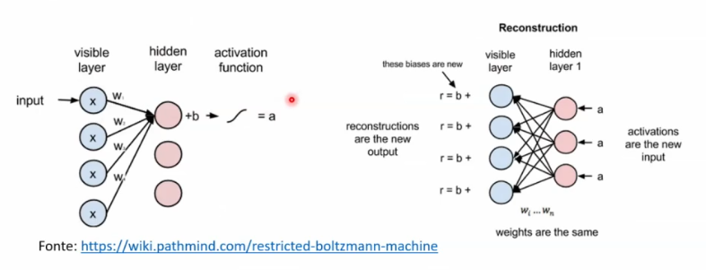
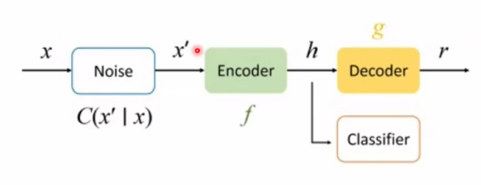

# Artificial Neural Network class


# Deep Learning I

Era Negra das Redes Artificiais

Livros: Introduction to Deep Learning - Springer
Deep Learning with Python

### XOR nas redes neurais
Linear separability and the XOR problem
As redes neurais clássicas não conseguiam separar bolinhas brancas das pretas com base na posição

Rede Neural Multicamada
Indentifica relações não lineares

### Estrutura da Rede
Camadas = grupo de neurônios em um estágio do processo

### Função perda
Predicted x Actual
Permite verificar o quão assertivo é determinada previsão

Depende do tipo de variável (Target) que estamos observando.

- Variáveis categóricas
- Variáveis contínuas
- Variáveis discretas

Pra variáveis quanti
MSE - mean square error
AME - Erro absoluto médio

Pra classificação (0, 1)
Binary cross-entropy
Categorical cross-entropy

### Viés vs. Variância
Grande problema da estatística
Importância da generalização
Teoria do mapa - eu busco um problema específico mas em algo que pode ser generalizado

Ausência de viés - na média vc acerta
Redução de Variância - tiro ao alvo

Overfitting - o modelo memorizou nos dados de treinamento
Underfitting - o modelo não pegou nenhuma especificidade dos dados, não tem capacidade de perceber isso
Fitting - a curva passa próximo aos dados - esse é o cara ideal

### Redução do overfitting
Quanto mais parâmetro, menor é a linearidade do modelo

Regularização
- Dropout: redução aleatória dos neurônios para uma camada durante a iteração, Introduz um ‘barulho’ na rede
- L1: ajuste dos pesos. Leva até zero
- L2: igual L1, porém leva proximo a zero

Early Stopping
Sem novas melhorias? Pode parar

### Batch
Treinamento em lotes
Reduz o custo computacional

### Hiperparâmetro
Qualquer número utilizado pela rede que não é aprendido
- Learning rate
- Batch size
- Epochs
- Função de ativação

### AutoML
- AutoKeras, H20
- Transfer Learning
- GridSearch

### Cross validation
- K fold

A idéia é utilizá-lo para o tuning.
Fica dentro da amostra de treinamento ainda, um substrato é separado para essa validação.
Mas ela fica ainda dentro do treinamento.
Não é recomendável pra achar a acurácia.


### Mínimo local e ponto de sela
O objetivo é chegar no valor mais baixo de perda.
O learning rate vai definir a velocidade do gradiente buscar o mínimo. E dependendo disso, não chegamos no valor mais baixo.

Conforme vamos testando, podemos, talvez, encontrar um valor menor ainda.

O menor local pode dizer que é o menor ponto, dentro de um recorte. Se olharmos o todo, talvez não seja verdade.

### Otimizadores
- Adagrad (gradiente descendo melhorado)
- Adam (esse é o mais utilizado, mais genérico)
- RMSPROP (séries temporais)


### Colab
Upload `Aula_2_2_1.ipynb`

Vai comparar o valor entre rede neural e decision tree.
Lembrando que o objetivo é didático.

Com o Gemini fica bem mais interessante.

Dataset: California Housing
`fetch_california_housing`


—
O MSE encontrado não significa nada. É preciso ter um benchmark para efeito de comparação válida.

Geralmente rodamos diversos modelos, então teremos como tomará-los entre eles. O MSE sozinho nada significa.

Rede Neural
`hidden_layer_size=(50, 30, 1)` - 3 camadas e quantos neurônios em cada uma delas

activation=“identity” - stivação linear
solver=“adam” - otimizador, o adam é um ótimo default, exceto para séries temporais, que o professor começa com outro

max_iter = 500 : são as épocas

O modelo rede neural se saiu melhor do que o decision tree.

—
Aula_2_2_2.ipynb
Breast cancer

Vamos comparar a rede neural contra  uma regresso linear

Vamos classificar em benigno ou maligno.

Pré processamento
1. Excluir os nan values
2. Transformar variável `class` em números (0 ou 1)


# Deep Learning II

### Redes neurais recorrentes
Livros 
- Neural Networks and Deep Learning - 
- Introduction to Deep Learning

Alguns problemas importantes:
- Dados de texto
- Séries temporais
- Assistir um filme

A Sequência importa
O gato perseguiu o rato
O rato perseguiu o gato

RNN - não se ‘importa’com a ordem.
Ela constrói uma distribuição de probabilidade

Rede Neural com memória
Guardar o que é importante e fazer previsões mais acuradas

### Simple recurrent neural network
Rede de Elman


### Backpropragation
- Tudo se afeta ao mesmo tempo
- O passado influencia, os pesos são ajustados, mas quanto mais longe, mais difícil de saber o tamanho dessa influência

Dissipação do gradiente (Vanishing gradient)
- Multiplicação por valores maiores que 1: sobe, distancia do zero
- Multiplicação por valores menores que 1: os números se aproximam de zero


Ocorre em qualquer rede - porém com mais frequência em RNN

### Como resolver?

**Backpropagation truncada**
- Solução arbitrária
- Para a avaliação de pesos até certo ponto
- Custo computacional

**Resolver o Vanishing Gradient**
- Inicialização de matriz de peso
- Função de ativação ReLU

**Clipping do Gradiente (mais famosa)**
- Solução possível para dissipação e explosão
- Define um valor limite definido nos gradientes

Nas arquiteturas anteriores (Elman), tentava guardar todo o passado - tipo as mulheres, que não esquecem nada.
As novas arquiteturas consideram somente o que é importante, um recorte do todo.
 

### LSTM
Long short-term memory
Será que devemos guardar uma informação?

Algumas funções importantes
**TANH** - tangente hiperbólica
Resultado entre -1 e 1 (negativo, neutro, positivo)

**Sigmoid**
Resultado entre 0 e 1 (sim ou não)

Estado da célula: memória longa
Forget Gate - portão do esquecimento - quanto lembrar?
Input gate - quanto manter dos inputs?
Output gate - o que do estado da célula e do hidden state será utilizado como resultado?


**GRU - Gate Recurrent Unit**
Resolve problema da dissipação do gradiente
Baseada em portões:
- Reset Gate
- Update Gate

Guarda dependência longa


### Transformers
- Maior parte de PLN era feito com RNN
- Attention is all you need (artigo importante)
- Uso de RNN => perde informação conforme se distancia do início de uma série
- Contexto é essencial em PLN (processamento de linguagem natural)

Codificador
Decodificador

O que é mais rápido para descobrir uma informação: ler o livro inteiro ou procurar no índice?
Os transformers criam estes índices

# Deep Learning III

### Deep Learning não supervisionado

**Modelos baseados em energia**

### Máquinas de Boltzmann
- É uma FNN de uma camada
- Objetivo: aprender a distribuição de probabilidades dos inputs
- ajustar pesos para ser possível reconstruir os inputs (entradas)
- Máquina restrita de Boltzmann
- Ajuda a classificar as features (já que não temos target)
- Se reconstroi bem, você classifica bem



**Aprendizado pela divergência constrastiva**
- Compara o valor reconstruído com o valor real
- Diferença entre entrada e `r` é verificada pela divergência de Kullback-Leibler

Aplicações Máquina de Boltzmann
- Redução de dimensionalidade
- Sistema de recomendação
- Reconstrução de imagem

Caso Netflix
- Recomendação baseada em conteúdo - filmes parecidos
- Recomendação baseada em filtragem colaborativa - perfis semelhantes

### DBN - Deep Belief Networks
ou Rede de Crenças Profundas é um tipo de modelo de aprendizado profundo que combune redes neurais com técnicas de aprendizado não supervisionado. Elas foram pioneiras no desenvolvimento de arquiteturas profundas e são compostas por várias Restricted Boltzmann Machines (RBMs) ou Autoencoders empilhados.


### Autoencoder
- Reconstrução de input
- Redução de dimensionalidade
- Autoencoder é como um gargalo, um funil

Um Autoencoder (ou Autoencodador) é uma rede neural não supervisionada usada para aprendizado de representações eficientes de dados. Ele é projetado para comprimir (codificar) os dados em uma representação compacta e depois reconstruir (decodificar) essa representação de volta a algo o mais próximo possível do dado original.

É como um sistema de "compactação e descompactação" aprendido a partir dos dados, sem a necessidade de rótulos.

https://miro.medium.com/v2/resize:fit:1400/1*44eDEuZBEsmG_TCAKRI3Kw@2x.png

encode > code > decode

**Estrutura Básica**

- Encoder (Codificador):
    - Reduz a dimensionalidade dos dados de entrada, transformando-os em uma representação latente (ou embedding).
    - Exemplo: Se a entrada tem 1000 dimensões, o encoder pode comprimi-la para 50.

- Bottleneck (Gargalo):
    - Camada intermediária que armazena a representação compactada dos dados.
    - É a parte mais importante, pois força a rede a aprender apenas as características mais relevantes.

- Decoder (Decodificador):
    - Reconstrói os dados originais a partir da representação latente.
    - Tenta gerar uma saída o mais parecida possível com a entrada.


**Processo:**
- O encoder comprime o dado de entrada em um espaço latente.
- O decoder tenta reconstruir o dado original a partir desse espaço.
- A rede ajusta seus pesos para reduzir o erro de reconstrução.


**Tipos de Autoencoders**

- Undercomplete Autoencoder
    - O gargalo tem dimensão menor que a entrada (para extrair características essenciais).

- Denoising Autoencoder
    - Recebe uma versão corrompida (com ruído) da entrada e tenta reconstruir a versão limpa.
    - Ajuda a aprender representações robustas.



- Sparse Autoencoder
    - Introduz restrições de esparsidade no espaço latente (ativações raras).
    - Útil para aprendizado de características mais distintas.
    - Aplica-se termo de regularização

- Variational Autoencoder (VAE)
    - Usado para geração de dados.
    - O espaço latente segue uma distribuição probabilística (normalmente Gaussiana).

- Convolutional Autoencoder
    - Usa camadas convolucionais para dados de imagem.
    - Melhor para aprender padrões espaciais.

**Aplicações**
- Redução de Dimensionalidade (como alternativa ao PCA).
- Remoção de Ruído (Denoising).
- Detecção de Anomalias (dados com padrões incomuns têm alta perda de reconstrução).
- Geração de Dados (especialmente VAEs).
- Sistemas de Recomendação (aprendizado de embeddings).


```python
from tensorflow.keras.layers import Input, Dense
from tensorflow.keras.models import Model

# Dados de entrada (ex: 784 pixels para MNIST)
input_dim = 784
encoding_dim = 32  # Dimensão do gargalo

# Encoder
input_layer = Input(shape=(input_dim,))
encoded = Dense(encoding_dim, activation='relu')(input_layer)

# Decoder
decoded = Dense(input_dim, activation='sigmoid')(encoded)

# Modelo Autoencoder
autoencoder = Model(input_layer, decoded)
autoencoder.compile(optimizer='adam', loss='mse')

# Treinamento (X_train é a entrada e o target ao mesmo tempo)
autoencoder.fit(X_train, X_train, epochs=50, batch_size=256)
```


## GAN - redes adversárias generativas

> Duas redes neurais entram em um bar... uma tenta enganar a outra, e o resultado é arte!

- a ideia mais interessante nos últimos 10 anos em Machine Learning
- duas redes competindo
- modelo generativo
- modelos discriminativos aprendem a fronteira entre classes (cachorro ou bolinhos)

Uma GAN é um sistema composto por duas redes neurais rivais:
- Gerador (Generator) → Cria dados falsos (ex: imagens).
- Discriminador (Discriminator) → Tenta detectar se os dados são reais ou falsos.

Elas competem em um jogo de gato e rato: o Gerador tanta enganar o Discriminador, enquanto o Discriminador tenta ficar cada vez melhor em detectar fraudes. Com o tempo, o Gerador se torna tão bom que produz dados indistinguíveis dos reais!


| Nome	| Descrição	| Exemplo de Uso |
| --- | --- | --- |
| Vanilla GAN	| A primeira proposta (2014, Ian Goodfellow).	| Geração simples de imagens. |
| DCGAN	| Usa redes convolucionais para imagens mais realistas.	|Rostos de celebridades falsas.|
| CycleGAN	| Transforma imagens de um domínio para outro sem pares supervisionados.	| Transformar cavalos em zebras.|
| StyleGAN	| Gera rostos hiper-realistas com controle fino (NVIDIA).	| ThisPersonDoesNotExist.com |
| WGAN	| Melhora a estabilidade do treinamento.	| Geração mais consistente.|


```python
from tensorflow.keras.layers import Dense, LeakyReLU, BatchNormalization
from tensorflow.keras.models import Sequential

# Gerador (transforma ruído em imagem)
generator = Sequential([
    Dense(256, input_dim=100), LeakyReLU(0.2), BatchNormalization(),
    Dense(512), LeakyReLU(0.2), BatchNormalization(),
    Dense(784, activation='tanh')  # Saída no formato de imagem 28x28
])

# Discriminador (classifica real vs. fake)
discriminator = Sequential([
    Dense(512, input_dim=784), LeakyReLU(0.2),
    Dense(256), LeakyReLU(0.2),
    Dense(1, activation='sigmoid')  # Probabilidade de ser real
])

# Combina as duas redes
gan = Sequential([generator, discriminator])
discriminator.compile(loss='binary_crossentropy', optimizer='adam')
discriminator.trainable = False  # Congela o discriminador no treino do gerador
gan.compile(loss='binary_crossentropy', optimizer='adam')

# Treinamento (loop adversarial)
for epoch in range(epochs):
    noise = np.random.normal(0, 1, (batch_size, 100))
    fake_images = generator.predict(noise)
    real_images = X_train[np.random.randint(0, X_train.shape[0], batch_size)]
    
    # Treina o discriminador
    d_loss_real = discriminator.train_on_batch(real_images, np.ones((batch_size, 1)))
    d_loss_fake = discriminator.train_on_batch(fake_images, np.zeros((batch_size, 1)))
    d_loss = 0.5 * np.add(d_loss_real, d_loss_fake)
    
    # Treina o gerador (para enganar o discriminador)
    noise = np.random.normal(0, 1, (batch_size, 100))
    g_loss = gan.train_on_batch(noise, np.ones((batch_size, 1)))
```

